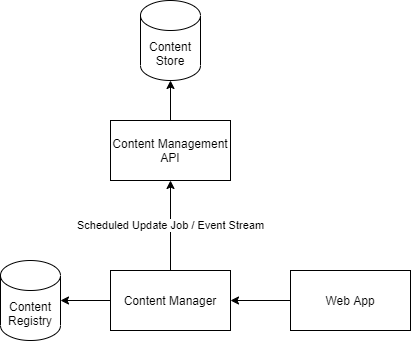

# PROOF OF CONCEPT

# priv_tube
A simple, private content sharing system for use by small groups of people.  The goal is to provide users the ability to link their own, private media servers in to a network which offers access control rules in addition to useful features like search and simple community capabilities, like view counts and comments.

# Running

```bash
python3 -m venv .venv
source .venv/bin/activate
pip install -r requirements.txt
python -m priv_tube.api
```

Or, if you're using Docker:

```bash
docker-compose build web
docker-compose run --service-ports web
```

# Creating Database Modifications
We use flask-migrate to manage all of our database migrations, and it in turn uses alembic.
When you create or modify a SQLAlchemy model, run `flask db migrate -m"your migration name here"` from the `/priv_tube/cms/db` folder to generate a new migration bringing in your changes.
When you need to create a new custom migration (to do something like generate a seed or create a stored procedure), instead run `alembic revision -m"your migration name here"` from the `/priv_tube/cms/db/migrations`.

To upgrade/downgrade the db, run `flask db upgrade/downgrade` locally (if you're working with it directly instead of using the docker image);

In both of the above scenarios, you will need to commit all the generated files.

# Definition of Terms

* A _content network_ is a collection of servers which are configured to host and share content via Content Management APIs.

# Design


The system can be thought of as two distinct parts: a content management component and a user application.

## Content Management
### Content Store
The service which houses the shareable content itself.  Initial iterations of this will just be a filesystem, but as the needs arise this can be scaled to include a variety of media hosting technologies.  This should be strictly locked down for security and containment purposes; the only system which should be able to issue commands to the Content Store should be the Content Management API.

### Content Management API
This is the one and only thing which will be able to operate on the content store.  This will handle access control rules and issue commands to the store itself in order to add, update, and delete content.  REPL apps for local management should go through this as well.  Over the long term we can break EAC out in to a separate authentication service should the needs arise.

### Content Registry
This is a database which contains listings for each piece of content stored within the content network.  This is updated by the content manager through scheduled jobs which reach out to all the configured Content Management APIs in order to fetch the latest list of configured media.

### Content Manager
The application layer.  This does the bulk of the work - it manages its local Content Registry through scheduled update jobs, it provides search functionality to the Web App, and it orchestrates forwarding of media from the Content Management API to the Web App and back to the client.

## Web Application
## Web App
This is the client and server for the simple web application which is the user-facing portion of this service.  Aside from GUI features (IE: the client), this should be a very bare-bones portion of the application.  All real functionality should be delegated to the other services described above.